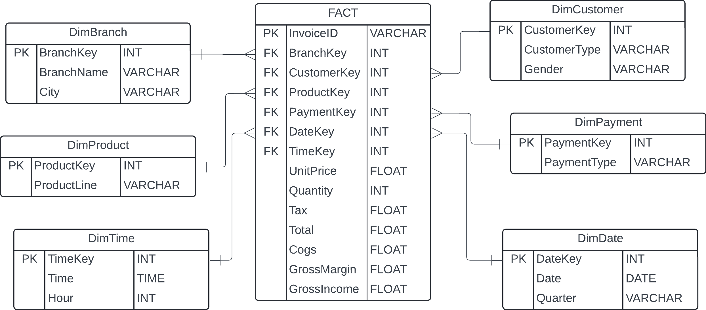

# Sales of Supermarket

A data engineering project focused on analyzing and processing supermarket sales data. This project aims to provide insights into sales trends, customer behavior, and inventory management using modern data engineering tools and techniques.

## Overview

This repository contains scripts and resources for ingesting, transforming, analyzing, and visualizing supermarket sales data. The project is structured to support scalable data pipelines and reproducible analytics.

## Schema Design


## Requirements

- Python 3.8+
- pip (Python package manager)
- Recommended: virtualenv

## Setup

1. **Clone the repository:**
    ```bash
    git clone https://github.com/yourusername/sales_of_supermarket.git
    cd sales_of_supermarket
    ```

2. **Create and activate a virtual environment:**
    ```bash
    python -m venv .venv
    .venv\Scripts\activate # On Linux/Mac: source venv/bin/activate  
    ```

3. **Install dependencies:**
    ```bash
    pip install -r requirements.txt
    ```

## How to Run

To run the ETL process, execute the following command:

```
python .\etl\run.py
```

_This will automatically extract, transform, and load data into a SQLite database._

## Project Structure

```
sales_of_supermarket/
├── etl/
│   ├── extract.py
│   ├── transform.py
│   ├── load.py
│   ├── utils.py
│   └── run.py
├── analysis/
│   |── charts/
│   |── python/
│   └── sql/
├── data/
│   ├── raw/
│   ├── processed/
│   └── dw/
├── logs/
├── requirements.txt
├── README.MD
└── .venv/
```

- `etl/`: Contains ETL scripts for data extraction, transformation, and loading.
- `analysis/`: Contains python and SQL scripts for data analysis and visualization.
- `data/raw/`: Directory for raw input data files.
- `data/processed/`: Directory for processed data files.
- `data/dw/`: Directory for SQLite data warehouse.
- `logs/`: Stores log files generated during ETL and analysis processes.
- `requirements.txt`: Lists Python dependencies.
- `README.MD`: Project documentation.

